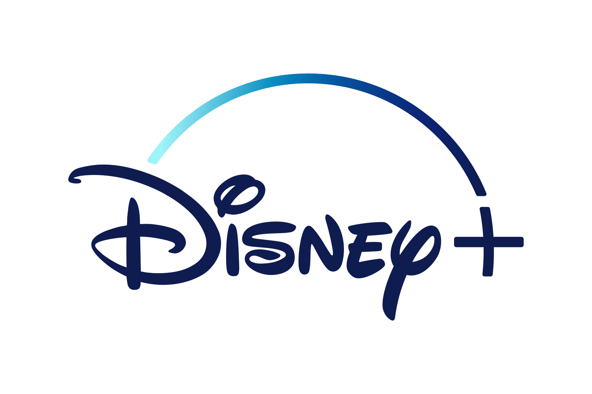

# Disney+ Clone Project



> 🔗 Looking for the frontend? Check out [disneyplus-clone-frontend-angular](https://github.com/itsluismario/disneyplus-clone-frontend-angular)
>
> 🔗 Looking for the backend? Check out [disneyplus-clone-backend-node-express](https://github.com/itsluismario/disneyplus-clone-backend-node-express)

## Description
A Disney+ clone application built with Angular (frontend) and Node.js (backend). This project demonstrates modern web development practices with a focus on user authentication, content management, and streaming capabilities.

## Related Repositories
This project is split into two repositories:

📱 **Frontend Repository**  
[disneyplus-clone-frontend-angular](https://github.com/itsluismario/disneyplus-clone-frontend-angular)
- Angular application
- TypeScript
- TailwindCSS
- JWT Authentication

⚙️ **Backend Repository**  
[disneyplus-clone-backend-node-express](https://github.com/itsluismario/disneyplus-clone-backend-node-express)
- Node.js/Express server
- MongoDB database
- Clerk Authentication
- RESTful API

## Prerequisites
- Node.js (v14 or higher)
- MongoDB
- npm or yarn package manager
- Clerk account (for backend authentication)

## Environment Variables Setup

Create a `.env` file in the root of your backend project and add the following variables:

```env
MONGODB_URI=your_mongodb_connection_string
API_KEY=your_api_key
API_READ_ACCESS_TOKEN=your_api_read_token
JWT_SECRET=your_jwt_secret_key
FRONTEND_URI=http://localhost:4200
CLERK_SECRET_KEY=your_clerk_secret_key
```

## Installation

### Backend Setup
1. Clone the backend repository
   ```bash
   git clone https://github.com/itsluismario/disneyplus-clone-backend-node-express.git
   cd disneyplus-clone-backend-node-express
   ```

2. Install dependencies
   ```bash
   npm install
   ```

3. Start the development server
   ```bash
   npm run dev
   ```

The backend server will start on http://localhost:3000

### Frontend Setup
1. Clone the frontend repository
   ```bash
   git clone https://github.com/itsluismario/disneyplus-clone-frontend-angular.git
   cd disneyplus-clone-frontend-angular
   ```

2. Install dependencies
   ```bash
   npm install
   ```

3. Start the Angular development server
   ```bash
   ng serve
   ```

The application will be available at http://localhost:4200

## Environment Variables Details

- `MONGODB_URI`: Your MongoDB connection string
- `API_KEY`: API key for external services
- `API_READ_ACCESS_TOKEN`: Read access token for API authentication
- `JWT_SECRET`: Secret key for JWT token generation
- `FRONTEND_URI`: URL of your frontend application (for CORS configuration)
- `CLERK_SECRET_KEY`: Secret key from your Clerk dashboard

## Features
- Secure authentication system
- Content streaming
- Responsive design
- Cross-platform compatibility

## Technology Stack
- Frontend: 
  - Angular
  - TypeScript
  - TailwindCSS
  - JWT for authentication
- Backend: 
  - Node.js
  - Express
  - MongoDB
  - Clerk Authentication

## Contributing
1. Fork the repository
2. Create your feature branch (`git checkout -b feature/AmazingFeature`)
3. Commit your changes (`git commit -m 'Add some AmazingFeature'`)
4. Push to the branch (`git push origin feature/AmazingFeature`)
5. Open a Pull Request

## License
This project is licensed under the MIT License - see the LICENSE file for details

## Acknowledgments
- Disney+ for inspiration
- Angular team for the amazing framework
- Node.js community for the robust backend environment
